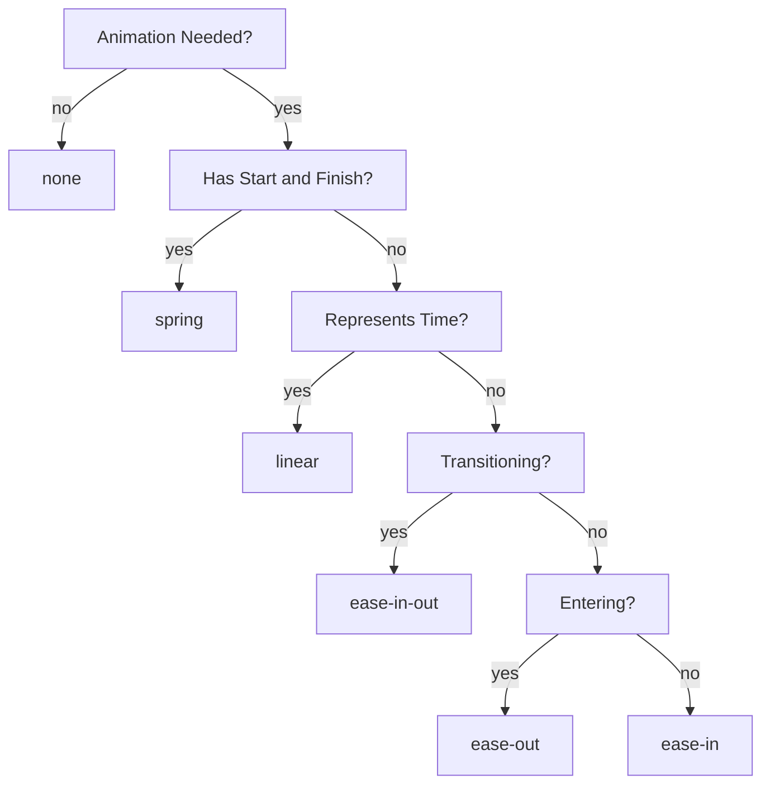

## How to choose the right animation

```mermaid
flowchart TD
    A[Animation Needed?] -->|no| B[none]
    A -->|yes| C[Has Start and Finish?]

    C -->|yes| D[spring]
    C -->|no| E[Represents Time?]

    E -->|yes| F[linear]
    E -->|no| G[Transitioning?]

    G -->|yes| H[ease-in-out]
    G -->|no| I[Entering?]

    I -->|yes| J[ease-out]
    I -->|no| K[ease-in]

```
